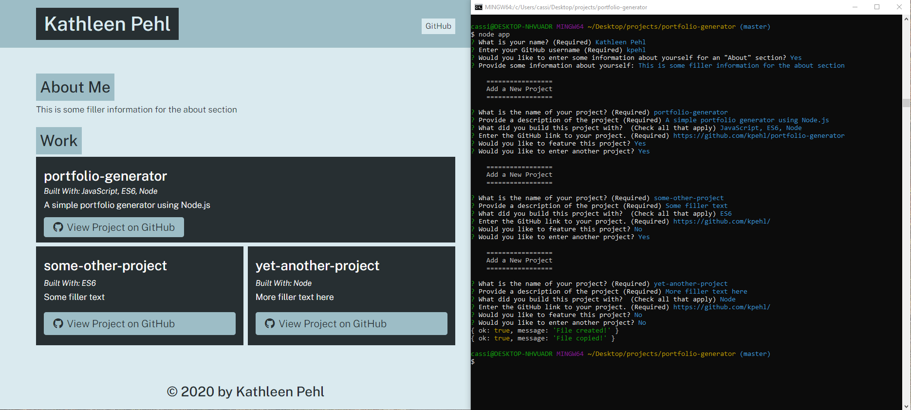

# Portfolio Generator

## Project Description
This project uses Node js to generate a simple portfolio page for a developer. The inquirer package from npm is used to create prompts for user information. Input is added to a page template, and the code then uses the file system module in Node.js to create an html file and to copy a style sheet to a distribution directory (dist), for easy export and uploading of the finished files to a desired server.

## Tools Used to Create the Project
* JavaScript ES6
* Node.js
* npm inquirer

## How to use the generator
* Clone this repository to your local computer
* In the directory where you have this project saved, make sure you're set with the required tools:
* Depending on what you already have installed, you may need to:
    * Install Node.js from [their website](https://nodejs.org/en/)
        * The default settings are acceptable
    * Initialize npm 
        * type `npm init` in your command line
    * Install the inquirer package from [npm](https://www.npmjs.com/package/inquirer)
        * type `npm install inquirer`
* From the command line in the directory with this project, type `node app` to run the program
* Answer the prompts with your information, or any mock data that you choose
* The application will create a simple portfolio webpage with your inputs and notify you that the HTML file was successfully created and that the CSS file was successfully copied from the source directory (src) to the distribution directory (dist)
* If desired, the HTML file and CSS file in the distribution directory could then be uploaded to a server as a functional live website

## Screenshot
